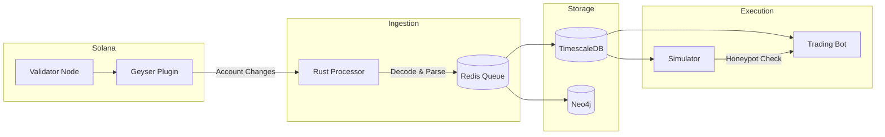
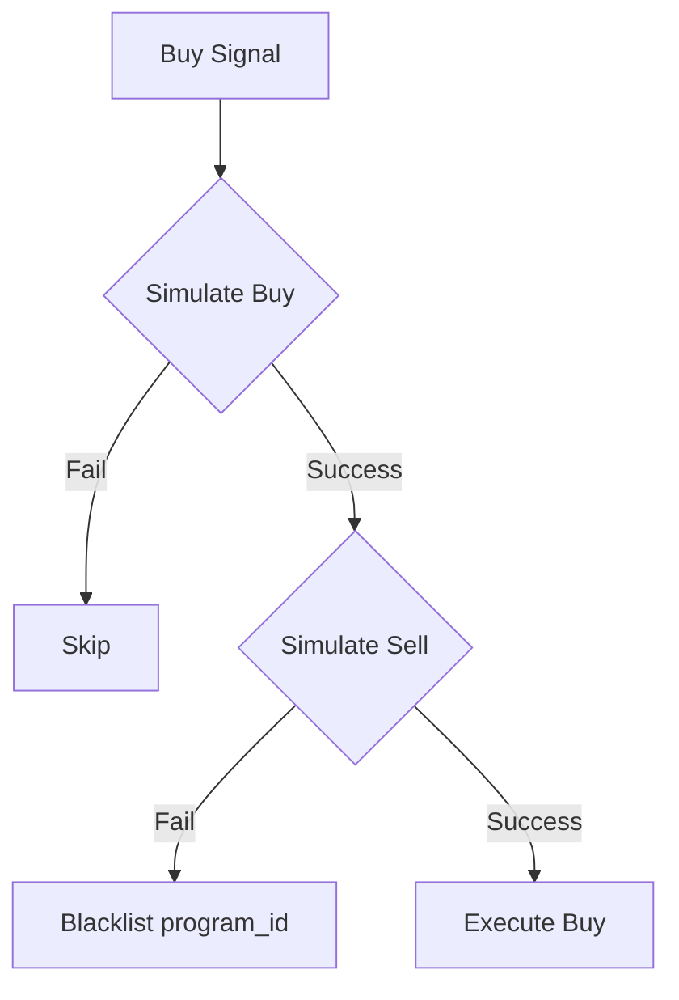

# Data Pipeline Architecture

## Overview
Real-time data flow from Solana validators to the intelligence database.

## Pipeline Flow



## Component Details

### 1. Geyser Plugin
**Recommended**: Helius or Yellowstone gRPC

- Streams raw account changes directly (bypasses standard RPC rate limits)
- Filters to relevant programs: SPL Token, Raydium, Jupiter, Pump.fun
- Latency: ~100-200ms from block confirmation

### 2. Rust Processor
Decodes Solana `Buffer` data into structured events:

```rust
// Decode flow
RawAccountData → Instruction Parser → tx_events Row
                                    ↓
                    { action, token_in, token_out, amount }
```

Key responsibilities:
- Parse program instructions (Raydium AMM, Jupiter aggregator)
- Extract mint addresses, amounts, decimals
- Calculate USD values via price feeds

### 3. TimescaleDB
Primary time-series store for `tx_events`.

**Query example** (execution bot):
```sql
SELECT wallet_address, token_in, SUM(amount_in) 
FROM tx_events 
WHERE event_time > NOW() - INTERVAL '5 minutes'
  AND wallet_address IN (SELECT address FROM tracked_wallets WHERE category = 'cabal')
GROUP BY wallet_address, token_in
HAVING SUM(amount_in) > 1000;
```

### 4. Pre-flight Simulation
Before execution, the bot:

1. Calls `simulateTransaction` with `replaceRecentBlockhash: true`
2. Checks TokenAccount balance increase
3. Simulates a Sell transaction
4. If sell fails with custom error → mark `is_honeypot = TRUE`


