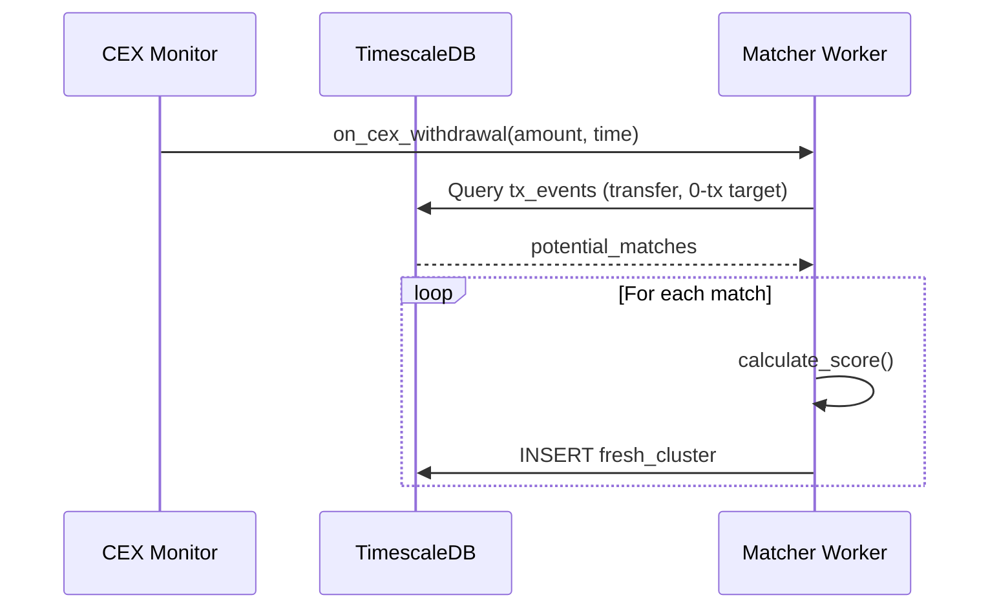

# Fresh Clusters Matcher Logic

## Overview
The Fresh Clusters Matcher identifies correlations between CEX withdrawals and fresh Solana wallet activity within a tight time window.

## Constants
```python
MAX_TIME_DELTA = 60000    # 60 seconds in ms
PRECISION_THRESHOLD = 0.99  # Amount must match within 1%
```

## Algorithm Flow



## Pseudocode

```python
def on_cex_withdrawal(cex_event):
    """
    Called when a CEX hot wallet sends a withdrawal.
    Monitors for matching 'fresh wallet' activity.
    """
    amount_low = cex_event.amount * 0.99
    amount_high = cex_event.amount
    time_window_end = cex_event.time + MAX_TIME_DELTA
    
    # Query for transfers to 0-tx (fresh) wallets within the window
    potential_matches = db.query("""
        SELECT * FROM tx_events 
        WHERE action = 'transfer' 
          AND target_tx_count = 0 
          AND amount BETWEEN %s AND %s
          AND event_time BETWEEN %s AND %s
    """, (amount_low, amount_high, cex_event.time, time_window_end))
    
    for match in potential_matches:
        score = calculate_score(cex_event, match)
        db.execute("""
            INSERT INTO fresh_clusters 
            (cex_source, withdrawal_tx, withdrawal_time, amount, decimals,
             target_wallet, target_tx_count, time_delta_ms, match_score)
            VALUES (%s, %s, %s, %s, %s, %s, %s, %s, %s)
        """, (
            cex_event.source,
            cex_event.tx_sig,
            cex_event.time,
            match.amount,
            match.decimals,
            match.wallet_address,
            0,
            match.event_time - cex_event.time,
            score
        ))

def calculate_score(cex_event, match):
    """
    Score based on:
    - Time proximity (closer = higher)
    - Decimal uniqueness (unusual amounts score higher)
    """
    time_score = 1 - (match.event_time - cex_event.time) / MAX_TIME_DELTA
    
    # Unusual decimal patterns suggest intentional amounts
    decimal_str = str(match.amount).split('.')[-1] if '.' in str(match.amount) else ''
    uniqueness_score = min(len(decimal_str) / 8, 1.0)
    
    return (time_score * 0.7) + (uniqueness_score * 0.3)
```

## Key Columns Used
| Table | Column | Purpose |
|-------|--------|---------|
| `tx_events` | `action` | Filter for 'transfer' type |
| `tx_events` | `amount_in` | Match against CEX withdrawal amount |
| `tx_events` | `event_time` | Time window correlation |
| `fresh_clusters` | `match_score` | Confidence of the correlation |
